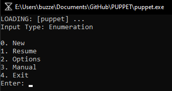
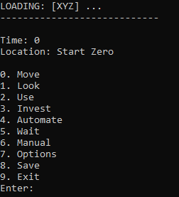

<h1>PUPPET</h1>

<em>[puppet]</em> is a strategy game where your enemies learn from your actions. 
Refer to the following sections of this manual for any game-related questions.
 
1. How to play
2. Gameplay
3. Comments

<em>**NOTE**: </em>[puppet]<em> is still in its build phase and is only available for testing gameplay. </em> 

[puppet] is built for Windows OS in C++. MinGW is not required to install (the library has been statically linked). A Mac OS and Linux version will be coming once the base game is complete. 

**1. HOW TO PLAY:** 
<em>[puppet]</em> can be played by running the **puppet.exe** file in the main directory on a Windows OS computer. When properly loaded, it should display the menu screen with 5 options, like so:  
 </img> 

<em>The Input Type and directory location may be different, but that's okay!</em>

The Input Type refers to how the user should select the list options. As <em>[puppet]</em> aims to allow for many different ways to play and enjoy the game (e.g. VR, audio-only), there will be many different ways to input decisions, but for now there are only two. 
1. **Enumeration**: List options can be selected by typing the respective index, e.g. if you wanted to start a new game, you would enter: 0. To resume, enter: 1, options: 2, and so on.
2. **String**: List options can be selected by typing the list option itself, e.g. if you wanted to start a new game, you would enter: New. You can also type it in lowercase (like "new"); tHe CaSe Of ThE lEtTeRs DoEs NoT mAtTeR.

Each menu options' descriptions are provided below:
<ul>
<li> <strong>New</strong>: This will start a new game. //Add intermitten menu screen.//
<li> <strong>Resume</strong>: This will resume a saved game if one is found. When running <em>[puppet]</em> for the first time or after completing a single run of <em>[puppet]</em>, this option will not resume and instead tell you that there is no game save.
<li> <strong>Options</strong>: This will bring you to the options menu, where you can select the Input Type.  <em>A lot</em> more options will be coming soon!
<li> <strong>Manual</strong>: This will bring you to the README.md file integrated into the game, which is what you are reading now! Crazy, huh? 
<li> <strong>Exit</strong>: This will exit the game. It will also automatically save the current run of <em>[puppet]</em> if there is one. The terminal will stay open, and can be closed by pressing any button afterwards.
</ul>
 
<strong>2. GAMEPLAY:</strong>
 
The objective of <em>[puppet]</em> is to create a character that will survive longer than its enemies. Each time you select <strong>"New"</strong> on the main menu, you start a new trial of [puppet], with more difficult enemies each time. More importantly, each new enemy will have learned what allowed your character to survive the longest in the previous trial, and will use your logic against you. 
 

After starting a new game or resuming a saved game, it will bring you to a new screen. These options below will be the actions to help you survive:  
 </img> 

Each options' descriptions are provided below:
<ul>
<li> <strong>Move</strong>: Brings you to the moving menu, which allows you to move to a connecting room if able.
<li> <strong>Look</strong>: (only for text gameplay) Prints out everything in the room.
<li> <strong>Use</strong>: Allows you to use objects in the room or 
in your inventory.
<li> <strong>Invest</strong>: Brings up the investing screen, which allows you to "purchase" items. Each character's money is measured by how long they have been alive (i.e. 1 second = 1 unit of money), minus how much they have spent on an item. Items can also be purchased on a loan, where the price instead is how many seconds in the future until the item is available. These items have to be dropped into a room in the XYZ facility, which must be determined when purchasing.
<li> <strong>Wait</strong>: Allows you to wait for a specified amount of seconds.
<li> <strong>Automate</strong>: The above actions (i.e. Move, Look, Use, Invest and Wait) can all be automated once the user performs them once. This allows you to test the strength of your character without having to continuously micro-manage every aspect over and over again in each trial. Automation of each character will depend on an internal Neural Network, which will determine the probability of a sequence of actions and select what should happen next up until something occurs that the user hasn't decided on before (e.g. entering the terminal room for the first time).
<li> <strong>Save</strong>: This will save the current trial, and allows you to play <em>[puppet]</em> from the same point by clicking "Resume" the next time!
<li> <strong> Manual, Options, </strong>and<strong> Exit</strong>: These are all the same as on the menu.
</ul>
<em><strong>IMPORTANT:</strong> Certain actions (Move, Use, Wait) take time to complete! Enemies will waste no time smashing your head in during these actions, but fortunately, these actions can be cancelled while performing them.</em> 
 
During gameplay without sound or a visual display, you may see text appear when time is moving.  
//add in image// 
This is to notify you that things are happening around you, and may indicate a nearby threat. Pay close attention to this, and assess the information accordingly!  
 
<strong>3. COMMENTS:</strong> 
<em>This section just serves to talk a bit about </em>[puppet]<em> outside of the gameplay.</em> 
 
<em>[puppet]</em> is part of a much larger project, which is the <em>[sin]</em> cycle. It is part of the third event of the cycle, along with two other titles, the film <em>[suspicion]</em> and comic <em>[trial]</em>. The <em>[sin]</em> cycle and its events all discuss different forms of replacement, while replacing components of the stage itself. 
 
For example, the first part of the cycle, the song cycle <em>Counterpoint</em>, dealt with the individual replacing their personality to acheive social prestige. The second part of the cycle, the opera <em>... the Elephant</em>, expands on the original dilemna, now replacing individuals with other individuals to satisfy a social need. <em>[puppet]</em> follows the theme as well, instead dealing with automation. Not only in the game can the user automate all actions taken by the character, but many components of <em>[puppet]</em> are also automated (e.g. music, sound design, voices). 
 
You may have noticed this as well, but <em>[puppet]</em>, <em>[sin]</em>, <em>[suspicion]</em> and <em>[trial]</em> all have brackets containing the lowercase title, while <em>Counterpoint</em> and <em>... the Elephant</em> have a capital letter and no brackets. This is because the brackets refer to events that haven't been published, so the title only refers to a theoretical instance of what could occur during that particular event. <em>Counterpoint</em> and <em>... the Elephant</em> have been performed, so everything that occurred in those events are set in stone. 
  
Because of the <em>[puppet]</em>'s rich history, there are so many secrets built into the game, and so many characters that you will meet and/or learn more about. While the game is being built, I put some files in the <strong>ref</strong> folder of the main directory that show some of my work related to what happens in <em>[puppet]</em>.  
 
Since you made it to the end of this file, I wanted to give you a little gift, without spoiling too much. Among the characters, there's one pretty nifty one you'll find at a bar. Find them in the game, and everyone will find you. 
 
www.jasonbuzzell.com/lvck